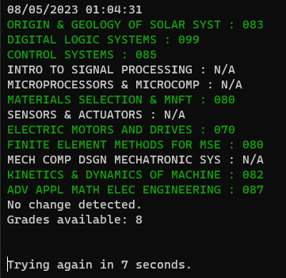

# Grade Scraper

A program that scrapes a student's grades from the university's student center (specific to Western University).

## Features

- Scrape grades for any term
- View grades in the terminal
- Option to receive notifications when grades are updated
  - Discord
  - Windows 10 toast notifications
  - Easily updated to include more actions

Here is a screenshot of what the program looks like:

## Requirements

- beautifulsoup4
- requests
- win10toast (optional, for Windows 10 toast notifications)
- discord (optional, for Discord notifications)
- colorama (optional, for colored terminal output)

## How to Use

1. Install the required packages by running `pip install -r requirements.txt`
2. Update `info.txt` with the student's login credentials and desired preferences.
3. Run the script using `python scraper.py`
4. Your grades will be printed to the terminal and, if enabled, sent as a notification to your Discord server and/or displayed as a Windows 10 toast notification.

## Notes

- This program has only been tested on Windows 10.
- The university's student center website and login process may change, which could break this program. Please open an issue if you encounter any problems.
